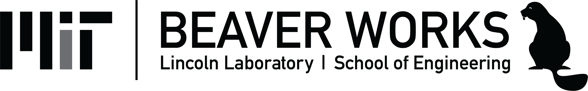

# Hello to students applying for BWSI 2020 (our 5th year)!

# Frequently Asked Questions (FAQ)

Note: BWSI is managed with just a few people that also have additional responsibilities, *PLEASE* make every effort to read or search this FAQ and to find the answers prior to emailing staff bwsi-admin@mit.edu .

| Question | Answer |
| ---- | ---- |
| Where can I get more information? | We try to keep our website as up-to-date as possible [BWSI](https://beaverworks.ll.mit.edu/CMS/bw/bwsi) |
| Do you offer programs for middle school? | We piloted our first course last year with the Mini-RACECAR course and plan on adding more this year. [Middle school program](https://beaverworks.ll.mit.edu/CMS/bw/node/351) |
| I can't attend for the full month- can I come for just part? | Our program is very intensive and very competitive, so we ask that students applying must attend the full program. |
| What other STEM program are available? | MIT has many programs [here](https://outreach.mit.edu) and Lincoln Laboratory has more listed [here](http://www.ll.mit.edu/outreach) |
| I'm a freshman/sophmore, can I apply? | We encourage interested students to be nominated to access the online course, but as we can only accept a limited number of students, students attending are generally finishing their junior year (i.e. rising seniors) |
| I'm a senior, can I apply? | Current seniors are not eligible to apply (you should be getting ready for college and mentoring younger students) |
|I'm a parent, can I attend? | Only the *final* event is open to everyone and we encourage parents and friends to visit to see their student's success, but we parents cannot visit during the program |
| What does the program cost? | The program is free for day students (students who are local or arrange their own local housing), residential students may be chargeda $5,000 housing fee for the program, but we have information on fee waivers [here](https://beaverworks.ll.mit.edu/CMS/bw/Summer_Program_Application#overlay-context=bwsi) |

# Application process
| Question | Answer |
| ---- | ---- |
| I did not receive BWSIX (or online course) registration email- why not? | Emails are sent to the addresses provided by your teacher, very often our emails are blocked by school network firewalls |
| How can I get BWSI emails at my school? | Talk to your school administrator to allow emails from "mit.edu" through the school firewall |
| How can I get BWSI emails at non-school email address? | Provide a non-school email address to your teacher when you ask them to nominate you for BWSI |
| Can you change my school email address on the form? | Due to our limited resources it may be faster to ask your teacher to resubmit a new nomination form with an email that won't be blocked |
| What do I after I get the BWSIX email? | See this [document](https://drive.google.com/open?id=1d_P8NgV6_GRblNVaFKq_uNasMmI42zw0) for more in-depth answers | 

# Online Course 
| Question | Answer |
| ---- | ---- |
|Can I take more than 1 online course? | You are eligible to work on more than 1 course (courses like RACECAR require it), voluntarily complete additional courses does not improve your chance of acceptance, but can provide interesting learning opportunities. |
| How long does it take to complete? | The length of time depends on your experience and skills, as well as the course selected, but encourage applicants to start early as it may take several weekends to complete a course |

 

# Internship Opportunities

Some of the sponsors of BWSI offer internships to students attending BWSI

| Name | Application Link | Additional Info | Due |
| ---- | ---------------- | --------------- | --- |
| BAE  | TBD | N/A | TBD |
| Raytheon | TBD |  N/A | TBD |
| Lockheed Martin | TBD | N/A | TBD |

 

# 2019 Seminars

We have world class researchers and educators present lunchtime lectures to attending students.  You can watch the webcasted seminars online, [Click Here](http://web.mit.edu/webcast/beaverworks/sum2019/)!

### 2019 Schedule  (2020 Coming soon!)

| Name | Date | Title |
| ---- | ---- | ----- |
| Prof. John Hart | 7/9/19 | Adventures in Additive Manufacturing |
| Jerry Wohletz | 7/11/19 | Autonomous Intelligence: The AI You Don’t Know |
| Katie Rae | 7/12/19 | Inspiring the Next Generation of Tough Tech Founders |
| Prof. Kerry Cahoy | 7/17/19 | Using Weather Balloons and CubeSats to Learn About Space Exploration |
| Prof. Neil Gershenfeld | 7/19/19 | How to Make (almost) Anything |
| Prof. Sanjay Sarma | 7/22/19 | How We Learn |
| Prof. Cynthia Breazeal | 7/24/19 | Toward Human-Friendly AI |
| Joonhee Won | 7/25/19 | The Future of Learning: Changing Pardigm of School |
| Prof. Evelyn Wang | 7/26/19 | Nanoengineered Materials for Advanced Energy and Water Technologies |
| Prof. Fikile Brushett | 7/29/19 | Building an Electrochemical Future: Innovators Needed! |
| Natalia Guerrero | 7/30/19 | Worlds Beyond Our Own: New Exoplanet Discoveries by NASA’s TESS |

# Program Links

| Name | Link |
| ---- | ---- |
| BWSI'19 Program Brochure | [Click Here](https://drive.google.com/file/d/1f6MtWChhFetyJVoSkKW4KYEGOP3-rO66/view?usp=sharing) |
| BWSI 2020 Brochure | [Click Here](https://drive.google.com/open?id=1DpJqwPsMZmlXzQ4zOXvnR2UlOJPyoP18)

 

